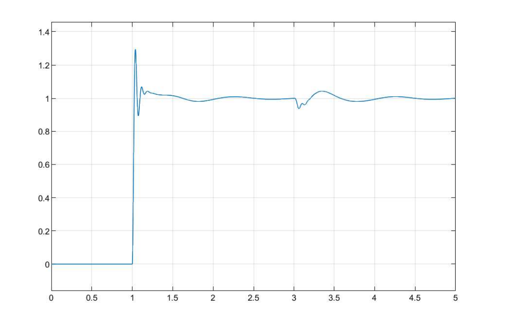

# Half Car Suspension Simulation

### Translational and rotational calculation

Parameter used (Toyot veloz 2022)

B1 (*Front body length from the CG*) = 1.35;

B2 (*Rear body length from the CG*) = 1.40;

KT1 (*Stiffness of the front tire material*) = 200000;

KT2 (*Stiffness of the rear tire material*) = 180000;

M1 (*Unsprung mass of the front axle*) = 28;

M2 (*Unsprung mass of the rear axle*) = 28;

M3 (*Sprung mass of the half vehicle Chassis*) = 835;

C1 (*Damping coefficient of the front axle*) = 1500;

C2 (*Damping coefficient of the rear axle*) = 1200;

I3 (*Moment of inertia of the vehicle*) = 418;

K1 (*Spring constant of the front axle*) = 25000;

K2 (*Spring constant of the rear axle*) = 20000;

### Output Exaple

Translation output